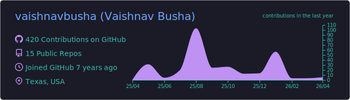
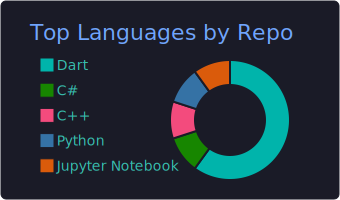
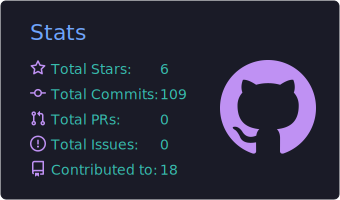
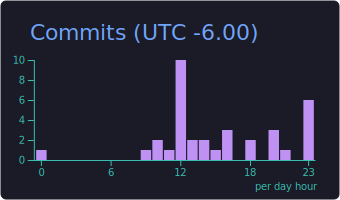

## Hi, I'm Vaishnav Busha 👋

Flutter Engineer and Full‑Stack Developer building cross‑platform apps and AI‑powered products.

### About me
- Architecting and developing FieldFuze, a cross‑platform field service management SaaS (iOS/Android/Web) with Stripe Connect payments, QuickBooks Online integration, FCM push notifications, Google Maps, and dynamic PDF invoicing; deployed to Play Store, App Store, and Web.
- Built Resumade, an agentic AI app (Next.js + FastAPI on AWS Lambda/DynamoDB with Amplify) that generates job‑tailored resumes with one‑click export.
- Published a neumorphic Calculator app with 100,000+ downloads on the Play Store.
- Previously at Accenture (Associate Software Engineer) and Acintyo Tech Innovations (Software Engineer).
- M.S. in Data Science @ University of North Texas (GPA 4.0/4.0).

### Socials

### Tech stack
                          

### GitHub stats

<!-- Local, auto-updated summary cards (generated daily via GitHub Actions) -->
<!-- Uncomment the block below after the first workflow run generates the images -->

